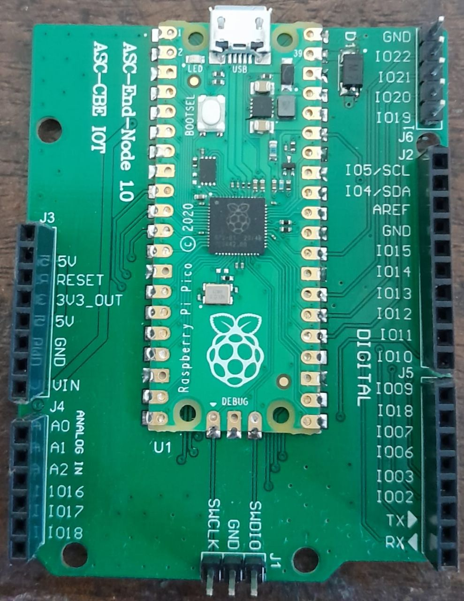

# ASC Pico IoT Board

A project with C code to interface the Raspberry Pi Pico with various sensors,
done by the students of Amrita Vishwa Vidyapeetham, Coimbatore


## Raspberry Pi Pico



The Raspberry Pi Pico is a low cost microcontroller. It uses GPIO pins to
interface with various sensors and actuators, and can be used for embedded systems and IoT
projects.

It is a flexible platform and can be programmed in MicroPython, or using C/C++.
Hence, it also serves as an effective learning tool

The ASC Pico IoT Board addresses a few issues of the Raspbery Pi Pico:
- Lack of 5V out
- Lack of headers to connect jumper wires to the board

## Compilation Instructions
1. Install CMake, and the GCC ARM compiler. On Ubuntu, the command is as follows:
```bash
sudo apt-get update
sudo apt-get install cmake gcc-arm-none-eabi libnewlib-arm-none-eabi build-essential libstdc++-arm-none-eabi-newlib
```

2. Clone the repository 
```bash
git clone https://github.com/aadit-n3rdy/pico-sensrs.git
cd pico-sensor
git submodule update --init --recursive
```

3. Set the env `PICO_SDK_PATH` environment variable
```bash
export PICO_SDK_PATH=`pwd`/pico-sdk
```

4. Create a build directory, and build the examples
```bash
mkdir build
cd build
cmake ..
```

5. Open any of the folders in the build directory, and build the .uf2 file. The following is
a demonstration for the `blink` example
```bash
cd blink
make -j4
```

6. Load the .uf2 file and execute it on the Raspberry Pi Pico 
(refer [Getting started with Raspberry Pi Pico](https://datasheets.raspberrypi.com/pico/getting-started-with-pico.pdf), section 3.2, for information on loading the .uf2 file)
